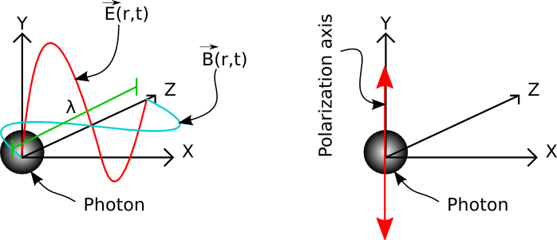

# Light, Computation, and Computational Light
We can establish an understanding of the term `Computational Light` as we explore the term `light` and its relation to `computation.`

## What is light?
Light surrounds us; we see the light and swim in the sea of light.
It is indeed a daily matter that we interact by looking out of our window to see what is outside, turning on the lights of a room, looking at our displays, taking pictures of our loved ones, walking in a night lit by moonlight, or downloading media from the internet.
Light is an eye-catching festival, reflecting, diffracting, interfering and refracting.
Is Light a wave or is it a ray or is it a quantum related phenomena?
Is light heavy or light-weight?
Is light the fastest thing in this universe?
How can we use light to trigger more innovations and positively impact our lives?
Light is something that we all experience, but we need to dig deep for clearly describing it.

In this introduction, my first intention here is to establish some basic scientific knowledge about light, which will help us understand why it is essential for the future of technology, especially computing.
Note that we will cover more details of light as we make progress through different chapters of this course.
But let's get this starting with the following statement.
Light is electromagnetic radiation, often described as a bundle of photons, a term first coined by Gilbert Lewis in 1926.

??? question end "Where can I learn more about electric and magnetic fields?"
    Beware that the topic of electric and magnetic fields deserves a stand-alone course and has many details to explore.
    As an undergraduate student, back in the day, I learned about electric and magnetic fields by following a dedicated class and reading this book: `Cheng, David Keun. "Fundamentals of engineering electromagnetics." (1993).`

??? question end "What is a photon?"
    Let me adjust this question a bit: `What model is good for describing a photon?`
    There is literature describing a photon as a single particle, and works show photons as a pack of particles.
     Suppose you want a more profound understanding than stating that it is a particle.
    In that case, you may want to dive deep into existing models in relation to the relativity concept: `Roychoudhuri, C., Kracklauer, A. F., & Creath, K. (Eds.). (2017). The nature of light: What is a photon?. CRC Press.`

??? question end "Where can I learn more about history of research on light?"
    There is a website showing noticeable people researching on light since ancient times and their contributions to the research on light.
    To reach out to this website to get a crash course, click [here](https://photonterrace.net/en/photon/history/).

Let me highlight that for anything to be electromagnetic, it must have electric and magnetic fields.
Let us start with this simple drawing to explain the characteristics of this electromagnetic radiation, light.
Note that this figure depicts a photon at the origin of XYZ axes.
But bear in mind that a photon's shape, weight, and characteristics are yet to be fully discovered and remain an open research question.
Beware that the figure depicts a photon as a sphere to provide ease of understanding.
_It does not mean that photons are spheres._

<figure markdown>
  { width="300" }
  <figcaption>A sketch showing XYZ axes and a photon depicted as a sphere.</figcaption>
</figure>

Let us imagine that our photon is traveling in the direction of the Z axes (notice $\vec{r}$, the direction vector).
Let us also imagine that this photon has an electric field, $\vec{E}(r,t)$ oscillating along the Y axes.
Typically this electric field is a sinusoidal oscillation following the equation, 
$$
\vec{E}(r,t) = A cos(wt),
$$
where $A$ is the amplitude of light, $w$ is equal to $2\pi f$ and $f$ represents the frequency of light.

<figure markdown>
  { width="300" }
  <figcaption>A sketch highligting electric and magnetic fields of light.</figcaption>
</figure>

A period of this sinusoidal oscillation, $\vec{E}(r, t)$, describes **wavelength of light**, $\lambda$.
In the most simple terms, $\lambda$ is also known as the **color of light**.
As light is electromagnetic, there is one more component than $\vec{E}(r,t)$ describing light.
The next component is the magnetic field, $\vec{B}(r, t)$.
The magnetic field of light, $\vec{B}(r, t)$, is always perpendicular to the electric field of light, $\vec{E}(r, t)$ (90 degrees along XY plane).
Since only one $\lambda$ is involved in our example, we call our light monochromatic.
This light would have been polychromatic if many other $\lambda$s were superimposed to create $\vec{E}(r, t)$.
In other words, monochromatic light is a single-color light, whereas polychromatic light contains many colors.

<figure markdown>
  { width="600" }
  <figcaption>A sketch showing electromagnetic spectrum with waves labelled in terms of their frequencies and temperatures..</figcaption>
</figure>

The concept of color originated from how we sense various $\lamba$s in nature.
Thus, we can not call all the electromagnetic radiation light.
When we refer to light, we mainly talk about visible light, $\lambda$s that our eyes could sense.
These $\lambda$s defining visible light fall into a tiny portion of the electromagnetic spectrum shown in the above sketch.
Mainly, visible light falls into the spectrum covering wavelengths between 380 nm and 750 nm.

<figure markdown>
  { width="600" }
  <figcaption>A sketch showing (left) electric and magnetic fields of light, and (b) polarization state of light.</figcaption>
</figure>

<figure markdown>
  { width="600" }
  <figcaption>Image caption</figcaption>
</figure>

## What is Computational Light?

??? question end "Where can I find basic information about optics and light?"
    As a graduate student, back in the day, I learned the basics of optics by reading this book without following any course: `Hecht, E. (2012). Optics. Pearson Education India.`
