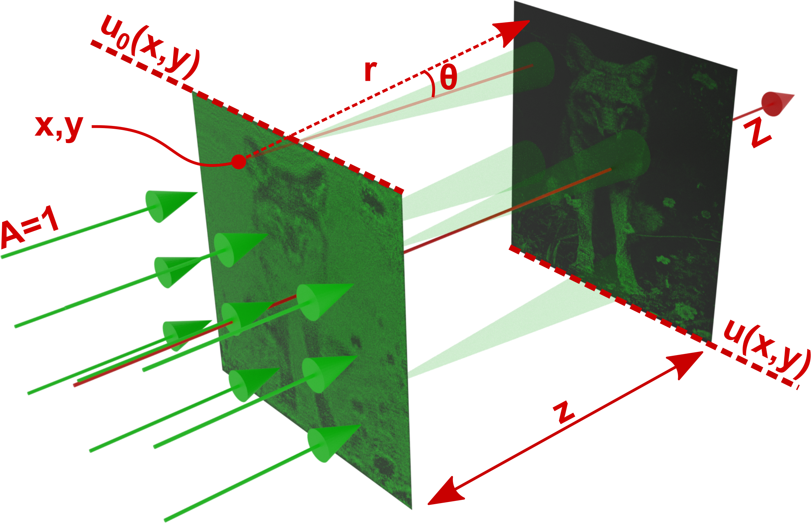

# Computer-Generated Holography

In this section, we introduce Computer-Generated Holography (CGI) [@born2013principles, @goodman2005introduction] as another emerging method to simulate light.
CGI offers an upgraded but more computationally expensive way to simulation concerning the raytracing method described in the previous section.
This section dives deep into CGI and will explain on the fly how CGI differs from raytracing as we go.
However, you may be wondering about the greater physical details of CGI.
In this case, we suggest our readers watch the video below.

??? question end "Where can I find an extensive summary on CGI?"
    Please watch this video for an extensive summary on CGI [@kavakli2022optimizing].
    
 <iframe width="560" height="315" src="https://www.youtube.com/embed/z_AtSgct6_I" title="YouTube video player" frameborder="0" allow="accelerometer; autoplay; clipboard-write; encrypted-media; gyroscope; picture-in-picture; web-share" allowfullscreen></iframe> 

??? tip end "Did you know?"
    There is an active repository on GitHub, where latest CGI papers relevant to display technologies are listed.
    Visit [GitHub:bchao1/awesome-holography](https://github.com/bchao1/awesome-holography) for more.

## Defining a slice of a lightfield :material-alert-decagram:{ .mdx-pulse title="Too important!" }

:octicons-info-24: Informative ·
:octicons-beaker-24: Practical

CGH deals with generating optical fields that capture light from various scenes.
CGH often describes these optical fields (a.k.a. lightfields, holograms) as planes.
So in CGH, light travels from plane to plane, as depicted below.

<figure markdown>
  { width="600" }
  <figcaption>A rendering showing how a slice (a.k.a. lightfield, optical field, hologram) propagates from one plane to another plane.</figcaption>
</figure>

In other words, in CGH, you define everything as a "lightfield," including light sources, materials, and objects.
Thus, we must first determine how to describe a lightfield to a computer.
So that we can run CGH simulations.
A lightfield is a planar slice in the context of CGH, as depicted in the above figure.
This planar is a pixelated 2D surface (matrix).
The pixels in this 2D slice hold values for the amplitude of light, $A$, and the phase of the light, $\phi$.
Whereas in classical raytracing, a ray only holds the amplitude or intensity of light.
With a caveat, though, raytracing could also be made to care about the phase of light. 
Still, it will then arrive with all the complications of raytracing simply, like sampling enough rays or describing scenes accurately.

Each pixel in this planar lightfield slice contains the value of $A cos(wt + \phi)$, where $A$ represents the amplitude and $\phi$ represents the phase.
If you recall our description of light, we explain that light is an electromagnetic phenomenon. Here, we model the oscillating electric field of light with $A cos(wt + \phi)$ shown in our previous light description.
Note that if we stick to $A cos(wt + \phi)$, each time to fields intersect, we have to deal with trigonometric conversion complexities like sampled in $A_0 cos(wt + \phi_0) + A_1 cos(wt + \phi_1)$, where the indices zero and one indicate the first and second fields.
Instead of trigonometry, what people do in CGH is use complex numbers as a proxy.
In its proxy form, a pixel value in a field is $A e^{-j \phi}$, where $j$ represents a complex number ($\sqrt{-1}$).
