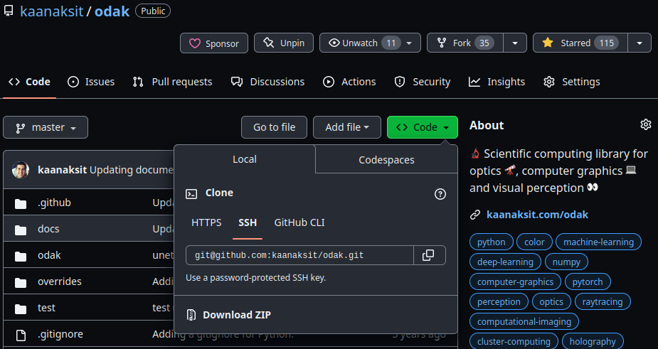
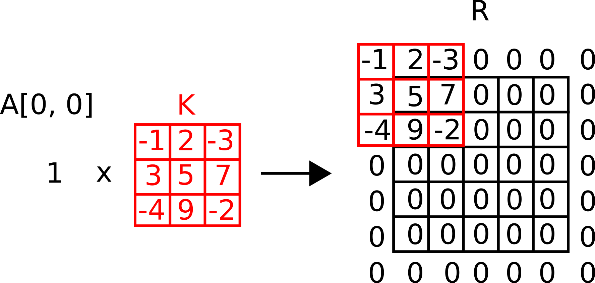
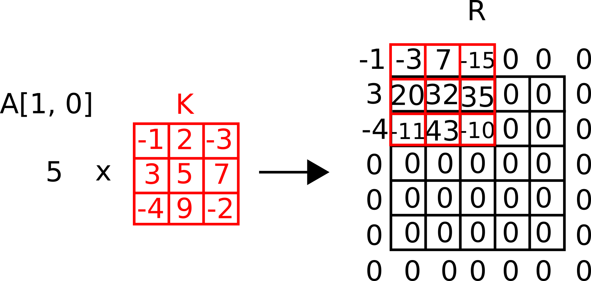

??? quote end "Narrate section"
    <audio controls="controls">
         <source type="audio/mp3" src="../media/fundamentals.mp3"></source>
    </audio>


# Fundamentals and Standards


This chapter will reveal some important basic information you will use in the rest of this course.
In addition, we will also introduce you to a structure where we establish some standards to decrease the chances of producing buggy or incompatible codes.


## Required Production Environment :material-alert-decagram:{ .mdx-pulse title="Too important!" }


:octicons-info-24: Informative ·
:octicons-beaker-24: Practical


We have provided some information in [prerequisites](index.md).
This information includes programming language requirements, required libraries, text editors, build environments, and operating system requirements.
For installing our library, odak, we strongly advise using the version in the source repository.
You can install odak from the source repository using your favorite terminal and operating system:


```shell
pip3 install git+https://github.com/kaanaksit/odak
```

Note that your production environment meaning your computer and required software for this course is important.
To avoid wasting time in the next chapters and get the most from this lecture, please ensure that you have dedicated enough time to set everything up as it should.


## Production Standards :material-alert-decagram:{ .mdx-pulse title="Too important!" }


:octicons-info-24: Informative


In this course, you will be asked to code and implement simulations related to the physics of light.
Your work, meaning your production, should strictly follow certain habits to help build better tools and developments.


### Subversion and Revision Control


:octicons-info-24: Informative ·
:octicons-beaker-24: Practical


As you develop your code for your future homework and projects, you will discover that many things could go wrong.
For example, the hard drive that contains the only copy of your code could be damaged, or your most trusted friend (so-called) can claim that she compiled most of the work, and gets her credit for it, although that is not the case.
These are just a few potential cases that may happen to you.
On the other hand, in business life, poor code control can cause companies to lose money by releasing incorrect codes or researchers to lose their reputations as their work is challenging to replicate.
_How do you claim in that case that you did your part?_
_What is the proper method to avoid losing data, time, effort, and motivation?_
_In short, what is the way to stay out of trouble?_

This is where the subversion, authoring, and revision control systems come into play, especially, for the example cases discussed in the previous paragraph.
In today's world, [Git](https://git-scm.com/) is a widespread version control system adopted by major websites such as [GitHub](https://github.com/) or [Gitlab](https://about.gitlab.com/).
We will not dive deep into how to use Git and all its features, but I will try to highlight parts that are essential for your workflow.
I encourage you to **use Git** for creating a repository for every one of your tasks in the future.
You can either keep this repository in your local and constantly back up somewhere else (suggested to people knowing what they are doing) or use these online services such as [GitHub](https://github.com/) or [Gitlab](https://about.gitlab.com/).
I also encourage you to use the online services if you are a beginner.


For each operating system, installing Git has its processes, but for an Ubuntu operating system, it is as easy as typing the following commands in your terminal:


```shell
sudo apt install git
```


Let us imagine that you want to start a repository on GitHub.
Make sure to create a private repository, and please only go public with any repository once you feel it is at a state where it can be shared with others.
Once you have created your repository on GitHub, you can clone the repository using the following command in a terminal:


```shell
git clone REPLACEWITHLOCATIONOFREPO
```


You can find out about the repository's location by visiting the repository's website that you have created.
The location is typically revealed by clicking the code button, as depicted in the below screenshot.


<figure markdown>
  { width="600" }
  <figcaption>A screenshot showing how you can acquire the link for cloning a repository from GitHub.</figcaption>
</figure>


For example, in the above case, the command should be updated with the following:


```shell
git clone git@github.com:kaanaksit/odak.git
```


If you want to share your private repository with someone you can go into the settings of your repository in its webpage and navigate to the collaborators section.
This way, you can assign roles to your collaborators that best suit your scenario.

!!! warning end "Secure your account"
    If you are using GitHub for your development, I highly encourage you to consider using [two-factor authentication](https://docs.github.com/en/authentication/securing-your-account-with-two-factor-authentication-2fa).

#### Git Basics
:octicons-info-24: Informative ·
:octicons-beaker-24: Practical

If you want to add new files to your subversion control system, use the following in a terminal:


```shell
git add YOURFILE.jpeg
```


And later, you can update the online copy (remote server or source) using the following:


```shell
git commit -am "Explain what you add in a short comment."
git push
```


In some cases, you may want to include large binary files in your project, such as a paper, video, or any other media you want to archive within your project repository.
For those cases, using just `git` may not be the best opinion, as Git works on creating a history of files and how they are changed at each commit, this history will likely be too bulky and oversized.
Thus, cloning a repository could be slow when large binary files and Git come together.
Assuming you are on an Ubuntu operating system, you can install the [Large File Support (LFS)](https://git-lfs.com/) for Git by typing these commands in your terminal:


```shell
sudo apt install git-lfs
```


Once you have the LFS installed in your operating system, you can then go into your repository and enable LFS:


```shell
cd YOURREPOSITORY
git lfs install
```


Now is the time to let your LFS track specific files to avoid overcrowding your Git history.
For example, you can track the `*.pdf` extension, meaning all the PDF files in your repository by typing the following command in your terminal:


```shell
git lfs track *.pdf
```


Finally, ensure the tracking information and LFS are copied to your remote/source repository. 
You can do that using the following commands in your terminal:


```shell
git add .gitattributes
git commit -am "Enabling large file support."
git push
```


## Coding Standards :material-alert-decagram:{ .mdx-pulse title="Too important!" }


:octicons-info-24: Informative ·
:octicons-beaker-24: Practical


I encourage our readers to follow the methods of coding highlighted here.
Following the methods that I am going to explain is not only crucial for developing replicable projects, but it is also vital for allowing other people to read your code with the least amount of hassle.


### Avoid using long lines.
Please avoid having too many characters in one line.
Let us start with a bad example:


```python
def light_transport(wavelength, distances, resolution, propagation_type, polarization, input_field, output_field, angles):
      pass
      return results
```


As you can observe, the above function requires multiple inputs to be provided.
Try making the inputs more readable by breaking lines and in some cases, you can also provide the requested type for an input and a default value to guide your users:


```python
def light_transport(
                    wavelength,
                    distances,
                    resolution,
                    propagation_type : str, 
                    polarization = 'vertical',
                    input_field = torch.rand(1, 1, 100, 100),
                    output_field = torch.zeros(1, 1, 100, 100),
                    angles= [0., 0., 0.]
                   ):
    pass
    return results
```


### Leave spaces between commands, variables, and functions


Please avoid writing code like a train of characters.
Here is a terrible coding example:


```python
def addition(x,y,z):
    result=2*y+z+x**2*3
    return result
```


Please leave spaces after each comma, `,`, and mathematical operation.
So now, we can correct the above example as in below:


```python
def addition(x, y, z):
    result = 2 * y + z + x ** 2 * 3
    return result
```


Please also leave two lines of space between the two functions.
Here is a bad example again:


```python
def add(x, y):
    return x + y
def multiply(x, y):
    return x * y
```


Instead, it should be:


```python
def add(x, y):
    return x + y


def multiply(x, y):
    return x * y
```


### Add documentation
For your code, please make sure to add the necessary documentation.
Here is a good example of doing that:


```python
def add(x, y):
    """
    A function to add two values together.

    Parameters
    ==========
    x         : float
                First input value.
    y         : float
                Second input value.

    Returns
    =======
    result    : float
                Result of the addition.
    """
    result = x + y
    return result
```


### Use a code-style checker and validator
There are also code-style checkers and code validators that you can adapt to your workflows when coding.
One of these code-style checkers and validators I use in my projects is `pyflakes.`
On an Ubuntu operating system, you can install `pyflakes` easily by typing these commands into your terminal:


```shell
sudo apt install python3-pyflakes
```


It could tell you about missing imports or undefined or unused variables.
You can use it on any Python script very easily:


```shell
pyflakes3 sample.py
```


In addition, I use `flake8` and `autopep8` for standard code violations.
To learn more about these, please read the [code section of the contribution guide](../contributing/#code).


### Naming variables
When naming variables use lower case letters and make sure that the variables are named in an explanatory manner.
Please also always use underscore as a replacement of space.
For example if you are going to create a variable for storing reconstructed image at some image plane, you can name that variable as `reconstructions_image_planes`. 


### Use fewer imports 
When it comes to importing libraries in your code, please make sure to use a minimal amount of libraries.
Using a few libraries can help you keep your code robust and working over newer generations of libraries.
Please stick to the libraries suggested in this course when coding for this course.
If you need access to some other library, please do [let us know!](https://github.com/kaanaksit/odak/discussions)


### Fixing bugs
Often, you can encounter bugs in your code.
To fix your code in such cases, I would like you to consider using a method called `Rubber duck debugging` or `Rubber ducking.`
The basic idea is to be able to express your code to a third person or yourself line by line.
Explaining line by line could help you see what is wrong with your code.
I am sure there are many recipes for solving bugs in codes.
I tried introducing you to one that works for me.


### Have a `requirements.txt` 
Please also make sure to have a `requirements.txt` in the root directory of your repository.
For example, in this course your `requirements.txt` would look like this:

``` 
odak>=0.2.3 
torch 
``` 

This way, a future user of your code could install the required libraries by following a simple command in a terminal:

```shell 
pip3 install -m requirements.txt 
``` 


### Always use the same function for saving and loading
Most issues in every software project come from repetition.
Imagine if you want to save and load images inside a code after some processing.
If you rely on manually coding a save and load routine in every corner of the same code, it is likely that when you change one of these saving or loading routines, you must modify the others.
In other words, do not rediscover what you have already known. 
Instead, turn it into a Lego brick you can use whenever needed.
For saving and loading images, please rely on functions in odak to avoid any issues.
For example, if I want to load a sample image called `letter.jpeg`, I can rely on this example:

```python
import odak
image = odak.learn.tools.load_image(
                                    'letter.jpeg',
                                    torch_style = True, # (1)!
                                    normalizeby = 255. # (2)!
                                   )
```

1.  If you set this flag to True, the image will be loaded
    as [ch x m x n], where ch represents the number of color channels (e.g., typically three).
    In case of False, it will be loaded as [m x n x ch].
2.  If you provide a floating number here, the image to be loaded will be divived with that number.
    For example, if you have a 8-bit image (0-255) and if you provide `normalizeby = 2.0`, the maximum
    value that you can expect is 255 / 2. = 127.5.


Odak also provides a standard method for saving your torch tensors as image files:

```python
odak.learn.tools.save_image(
                            'copy.png',
                            image,
                            cmin = 0., # (1)!
                            cmax = 1., # (2)!
                            color_depth = 8 # (3)!
                           )
```


1.  Minimum expected value for torch tensor `image`.
2.  Maximum expected value for torch tensor `image`.
3.  Pixel depth of the image to be saved, default is 8-bit.


You may want to try the same code with different settings in some code development.
In those cases, I create a separate `settings` folder in the root directory of my projects and add `JSON` files that I can load for testing different cases.
To explain the case better, let us assume we will change the number of light sources in some simulations.
Let's first assume that we create a settings file as `settings/experiment_000.txt` in the root directory and fill it with the following content:


```json
{
  "light source" : {
                    "count" : 5,
                    "type"  : "LED"
                   }
}
```


In the rest of my code, I can read, modify and save JSON files using odak functions:


```python
import odak
settings = odak.tools.load_dictionary('./settings/experiment_000.txt')
settings['light source']['count'] = 10
odak.tools.save_dictionary(settings, './settings/experiment_000.txt')
```


This way, you do not have to memorize the variables you used for every experiment you conducted with the same piece of code.
You can have a dedicated settings file for each experiment.


### Create unit tests

Suppose your project is a library containing multiple valuable functions for developing other projects. 
In that case, I encourage you to create unit tests for your library so that whenever you update it, you can see if your updates break anything in that library.
For this purpose, consider creating a `test` directory in the root folder of your repository.
In that directory, you can create separate Python scripts for testing out various functions of your library.
Say there is a function called `add` in your project `MOSTAWESOMECODEEVER,` so your test script `test/test_add.py` should look like this:

```python
import MOSTAWESOMECODEEVER

def test():
    ground_truth = 3 + 5
    result = MOSTAWESOMECODEEVER.add(3, 5)
    if ground_trurth == result:
        assert True == True
    assert False == True


if __name__ == '__main__':
    sys.exit(test())
```

You may accumulate various unit tests in your `test` directory.
To test them all before pushing them to your repository, you can rely on `pytest.`
You can install `pytest` using the following command in your terminal:


```shell
pip3 install pytest
```


Once installed, you can navigate to your repository's root directory and call `pytest` to test things out:


```shell
cd MOSTAWESOMECODEEVER
pytest
```

If anything is wrong with your unit tests, which validate your functions, `pytest` will provide a detailed explanation.Suppose your project is a library containing multiple valuable functions for developing other projects. 
In that case, I encourage you to create unit tests for your library so that whenever you update it, you can see if your updates break anything in that library.
For this purpose, consider creating a `test` directory in the root folder of your repository.
In that directory, you can create separate Python scripts for testing out various functions of your library.
Say there is a function called `add` in your project `MOSTAWESOMECODEEVER,` so your test script `test/test_add.py` should look like this:

```python
import MOSTAWESOMECODEEVER

def test():
    ground_truth = 3 + 5
    result = MOSTAWESOMECODEEVER.add(3, 5)
    if ground_trurth == result:
        assert True == True
    assert False == True


if __name__ == '__main__':
    sys.exit(test())
```

You may accumulate various unit tests in your `test` directory.
To test them all before pushing them to your repository, you can rely on `pytest.`
You can install `pytest` using the following command in your terminal:


```shell
pip3 install pytest
```


Once installed, you can navigate to your repository's root directory and call `pytest` to test things out:


```shell
cd MOSTAWESOMECODEEVER
pytest
```

If anything is wrong with your unit tests, which validate your functions, `pytest` will provide a detailed explanation.


## Set a licence
If you want to distribute your code online, consider adding a license to avoid having difficulties related to sharing with others.
In other words, you can add `LICENSE.txt` in the root directory of your repository.
To determine which license works best for you, consider visiting [this guideline](https://docs.github.com/en/repositories/managing-your-repositorys-settings-and-features/customizing-your-repository/licensing-a-repository).
When choosing a license for your project, consider tinkering about whether you agree people are building a product out of your work or derivate, etc.


??? example end "Lab work: Prepare a project repository"
    Please prepare a sample repository on GitHub using the information provided in the above sections. 

 
## Background Review :material-alert-decagram:{ .mdx-pulse title="Too important!" }


:octicons-info-24: Informative ·
:octicons-eye-24: Media


Here, I will review some basic mathematical concepts using equations, images, or codes.
Please note that you must understand these concepts to avoid difficulty following this course.


### Convolution Operation
Convolution is a mathematical operation used as a building block for describing systems.
It has proven to be highly effective in machine learning and deep learning.
Convolution operation often denoted with a `*` symbol.
Assume there is a matrix, A, which we want to convolve with some other matrix, also known as the kernel, K.


<figure markdown>
  { width="600" }
  <figcaption>A sketch showing a matrix and a kernel to be convolved.</figcaption>
</figure>


One can define such a matrix and a kernel using Torch in Python:


```python
a = torch.tensor(
                 [
                  [1, 5, 9, 2, 3],
                  [4, 8, 2, 3, 6],
                  [7, 2, 0, 1, 3],
                  [9, 6, 4, 2, 5],
                  [2, 3, 5, 7, 4]
                 ]
                )
k = torch.tensor(
                 [
                  [-1, 2, -3], 
                  [ 3, 5,  7], 
                  [-4, 9, -2]
                 ]
                )
```


To convolve these two matrices without losing information, we first have to go through a mathematical operation called zero padding.


<figure markdown>
  { width="600" }
  <figcaption>A sketch showing zeropadding operating on a matrix.</figcaption>
</figure>


To zeropad the matrix A, you can rely on Odak:


```python
import odak

a_zeropad = odak.learn.tools.zero_pad(a, size = [7, 7])
```

Note that we pass here size as `[7, 7]`, the logic of this is very simple.
Our original matrix was five by five if you add a zero along two axis, you get seven by seven as the new requested size.
Also note that our kernel is three by three.
There could be cases where there is a larger kernel size.
In those cases, you want to zeropad half the size of kernel (e.g., original size plus half the kernel size, `a.shape[0] + k.shape[0] // 2`).
Now we choose the first element in the original matrix A, multiply it with the kernel, and add it to a matrix R.
But note that we add the results of our summation by centring it with the original location of the first element.


<figure markdown>
  { width="600" }
  <figcaption>A sketch showing the first step of a convolution operation.</figcaption>
</figure>


We have to repeat this operation for each element in our original matrix and accummulate a result.


<figure markdown>
  { width="600" }
  <figcaption>A sketch showing the second step of a convolution operation.</figcaption>
</figure>


Note that there are other ways to describe and implement the convolution operation.
Thus far, this definition formulates a simplistic description for convolution. 


??? example end "Lab work: Implement convolution operation using Numpy"
    There are three possible ways to implement convolution operation on a computer.
    The first one involves loops visiting each point in a given data.
    The second involves formulating a convolution operation as matrix multiplication, and the final one involves implementing convolution as a multiplication operation in the Fourier domain.
    Implement all these three methods using Jupyter Notebooks and visually prove that they are all functioning correctly with various kernels (e.g., convolving image with a kernel).


In summary, the convolution operation is heavily used in describing optical systems, computer vision-related algorithms, and state-of-the-art machine learning techniques.
Thus, understanding this mathematical operation is extremely important not only for this course but also for undergraduate and graduate-level courses.
As an example, let's see step by step how a sample image provided below is convolved:


<figure markdown>
  { width="600" }
  <figcaption>An animation showing the steps of convolution operation.</figcaption>
</figure>


and the original image is as below:


<figure markdown>
  { width="600" }
  <figcaption>Original image before the convolution operation (Generated by <a href="https://github.com/Stability-AI/stablediffusion">Stable Diffusion</a>).</figcaption>
</figure>


??? example end "Lab work: Convolve an image with a Gaussian kernel"
    Using Odak and Torch, blur an image using a Gaussian kernel.
    Also try compiling an animation like the one shown above using Matplotlib.


### Gradient Descent Optimizers
Throughout this course, we will have to optimize variables to generate a solution for our problems.
Thus, we need a scalable method to optimize various variables in future problems and tasks.
We will not review optimizers in this section but provide a working solution.
You can learn more about optimizers through other courses offered within our curriculum or through suggested readings. 
State-of-the-art Gradient Descent (GD) optimizers could play a key role here. 
Significantly, Stochastic Gradient Descent (SGD) optimizers can help resolve our problems in the future with a reasonable memory footprint.
This is because GD updates its weights by visiting every sample in a dataset, whereas SGD can update using only randomly chosen data from that dataset.
Thus, SGD requires less memory for each update.

??? question end "Where can I read more about the state-of-the-art Stochastic Gradient Descent optimizer?"
    To learn more, please read `Paszke, Adam, Sam Gross, Soumith Chintala, Gregory Chanan, Edward Yang, Zachary DeVito, Zeming Lin, Alban Desmaison, Luca Antiga, and Adam Lerer. "Automatic differentiation in pytorch." (2017).`

??? example end "Would you like to code your Gradient Descent based optimizer ground up?"
    In case you are interested in coding your Gradient Descent-based optimizer from the ground up, consider watching this tutorial online where I code the optimizer using only `Numpy`:
    <center> <iframe width="560" height="315" src="https://www.youtube.com/embed/-ilAaJlUvYI" title="YouTube video player" frameborder="0" allow="accelerometer; autoplay; clipboard-write; encrypted-media; gyroscope; picture-in-picture; web-share" allowfullscreen></iframe> </center>


Torch is a blessing for people that optimizes or trains with their algorithm.
Torch also comes with a set of state-of-the-art optimizers.
One of these optimizers is called the ADAM optimizer, `torch.optim.Adam`.
Let's observe the below example to make sense of how this optimizer can help us to optimize various variables.

```python
import torch
import odak  
import sys   # (1)!


def forward(x, m, n): # (2)!
    y = m * x + n
    return y


def main():
    m = torch.tensor([100.], requires_grad = True)
    n = torch.tensor([0.], requires_grad = True) # (3)!
    x_vals = torch.tensor([1., 2., 3., 100.])
    y_vals = torch.tensor([5., 6., 7., 101.]) # (4)!
    optimizer = torch.optim.Adam([m, n], lr = 5e1) # (5)!
    loss_function = torch.nn.MSELoss() # (6)!
    for step in range(1000):
        optimizer.zero_grad() # (7)!
        y_estimate = forward(x_vals, m, n) # (8)!
        loss = loss_function(y_estimate, y_vals) # (9)!
        loss.backward(retain_graph = True)
        optimizer.step() # (10)!
        print('Step: {}, Loss: {}'.format(step, loss.item()))
    print(m, n)


if __name__ == '__main__':
    sys.exit(main())
```

1.  Required libraries are imported.
2.  Let's assume that we are aiming to fit a line to some data (y = mx + n).
3.  As we are aiming to fit a line, we have to find a proper m and n for our line (y = mx + n).
    Pay attention to the fact that we have to make these variables differentiable by setting `requires_grad = True`.
4.  Here is a sample dataset of X and Y values.
5.  We define an Adam optimizer and ask our optimizer to optimize m and n.
6.  We need some metric to identify if we are optimizer is optimizing correctly.
    Here, we choose a L2 norm (least mean square) as our metric.
7.  We clear graph before each iteration.
8.  We make our estimation for Y values using the most current m and n values suggested by the optimizer.
9.  We compare our estimation with original Y values to help our optimizer update m and n values.
10. Loss and optimizer help us move in the right direction for updating m and n values.


## Conclusion
We covered a lot of grounds in terms of coding standards, how to organize a project repository, and how basic things work in odak and Torch.
Please ensure you understand the essential information in this section.
Please note that we will use this information in this course's following sections and stages.

??? tip end "Consider revisiting this chapter"
    Remember that you can always revisit this chapter as you progress with the course and as you need it.
    This chapter is vital for establishing a means to complete your assignments and could help formulate a suitable base to collaborate and work with [my research group](https://complightlab.com) in the future or other experts in the field.


!!! warning end "Reminder"
    We host a Slack group with more than 300 members.
    This Slack group focuses on the topics of rendering, perception, displays and cameras.
    The group is open to public and you can become a member by following [this link](https://complightlab.com/outreach/).
    Readers can get in-touch with the wider community using this public group.
