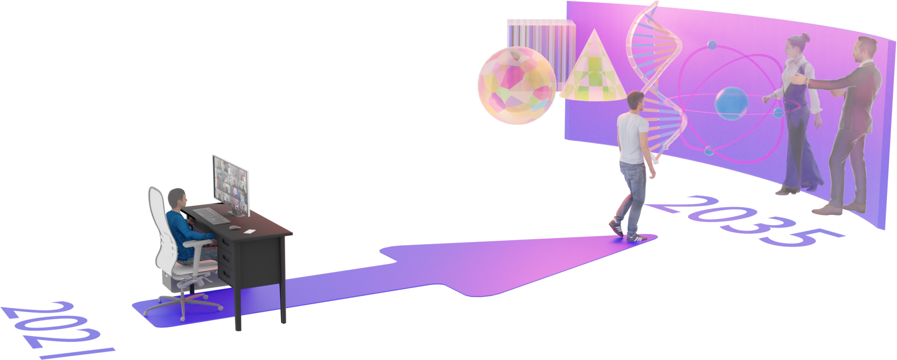

??? quote end "Narrate section"
    <audio controls="controls">
         <source type="audio/mp3" src="media/index.mp3"></source>
    </audio>


# Prerequisites and general information

**You have reached the website for the Computational Light Course.**

This page is the starting point for the **Computational Light** course.
Readers can follow the course material found on these pages to learn more about the field of **Computational Light**.
I encourage readers to carefully read this page to decide if they want to continue with the course.


## Brief course description
Computational Light is a term that brings the concepts in computational methods with the characteristics of light. In other words, wherever we can program the qualities of light, such as its intensity or direction, this will get us into the topics of Computational Light. Some well-known subfields of Computational Light are Computer Graphics, Computational Displays, Computational Photography, Computational Imaging and Sensing, Computational Optics and Fabrication, Optical Communication, and All-optical Machine Learning.


<figure markdown>
  { width="600" }
  <figcaption>Future is yet to be decided. Will you help me build it? A rendering from <a href="https://kaanaksit.com/assets/pdf/OrloskyEtAl_FrontiersInVirtualReality2021_Telelife_the_future_of_remote_living.pdf">Telelife vision paper</a>.</figcaption>
</figure>
[@orlosky2021telelife]


Computational Light Course bridges the gap between Computer Science and physics. In other words, Computational Light Course offers students a gateway to get familiar with various aspects of the physics of light, the human visual system, computational methods in designing light-based devices, and applications of light. Precisely, students will familiarize themselves with designing and implementing graphics, display, sensor, and camera systems using state-of-the-art deep learning and optimization methods. A deep understanding of these topics can help students become experts in the computational design of new graphics, displays, sensors, and camera systems.


## Prerequisites
These are the prerequisites of **Computational Light** course:


- **Background knowledge.** First and foremost being fluent in programming with [Python programming language](https://www.python.org/) and a graduate-level understanding of `Linear Algebra,` and  `Machine Learning` are highly required.
- **Skills and abilities.** Throughout the entire course, three libraries will be used, and these libraries include [`odak`](https://github.com/kaanaksit/odak), [`numpy`](https://numpy.org/), and [`torch`](https://pytorch.org/).
Familiarity with these libraries is a big plus.
- **Required Resources.** Readers need a computer with decent computational resources (e.g., GPU) when working on the provided materials, laboratory work, and projects. 
In case you do not have the right resources, consider using [Google's Colab](https://colab.research.google.com/) service as it is free to students.
Note that at each section of the course, you will be provided with relevant reading materials on the spot.
- **Expectations.** Readers also need sustainable motivation to learn new things related to the topics of `Computational Light,` and willing to advance the field by developing, innovating and researching. 
In other terms, you are someone motivated to create a positive impact in the society with light related innovations. 
You can also be someone eager to understand and learn physics behind light and how you can simulate light related phenomena.


## Questions and Answers
Here are some questions and answers related to the course that readers may ask:


??? question end "What is the overarching rationale for the module?"
    Historically, physics and electronics departments in various universities study and teach the physics of light.
    This way, new light-based devices and equipment have been invented, such as displays, cameras, and fiber networks, in the past, and these devices continuously serve our societies.
    However, emerging topics from mathematics and computer science departments, such as deep learning and advanced optimization methods, unlocked new capabilities for existing light-based devices and started to play a crucial role in designing the next generation of these devices.
    The Computational Light Course aims to bridge this gap between Computer Science and physics by providing a fundamental understanding of light and computational methods that helps to explore new possibilities with light.


??? question end "Who is the target audience of Computational Light course?"
    The Computational Light course is designed for individuals willing to learn how to develop and invent light-based practical systems for next-generation human-computer interfaces.
    This course targets a graduate-level audience in Computer Science, Physics and Electrical and Electronics Engineering departments. 
    However, you do not have to be strictly from one of the highlighted targeted audiences.
    Simply put, if you think you can learn and are eager to learn, no one will stop you.


??? question end "How can I learn Python programming, linear Algebra and machine learning?"
    There isn't a point in providing references on how to learn `Python programming,` `Linear Algebra,` and `Machine Learning` as there is a vast amount of resources online or in your previous university courses.
    Your favorite search engine is your friend in this case.


??? question end "How do I install Python, numpy and torch?"
    The installation guide for [python](https://www.python.org/), [numpy](https://numpy.org/) and [torch](https://pytorch.org/) is also available on their websites.


??? question end "How do I install odak?"
      Odak's [installation page](http://127.0.0.1:8000/odak/installation/) and [README](https://github.com/kaanaksit/odak) provide the most up-to-date information on installing odak.
      But in a nutshell, all you need is to use the following command in a terminal `pip3 install odak` for the latest version, or if you want to install the latest code from the source, use `pip3 install git+https://github.com/kaanaksit/odak`.

??? question end "Which Python environment and operating system should I use?"
    I use the Python distribution shipped with a traditional Linux distribution (e.g., Ubuntu).
    Again, there isn't no one correct answer here for everyone.
    You can use any operating system (e.g., Windows, Mac) and Python distribution (e.g., conda).


??? question end "Which text editor should I use for programming?"
    I use [vim](https://www.vim.org/) as my text editor.
    However, I understand that `vim` could be challenging to adopt, especially as a newcomer.
    The pattern I observe among collaborators and students is that they use [Microsoft's Visual Studio](https://visualstudio.microsoft.com), a competent text editor with artificial intelligence support through subscription and works across various operating systems.
    I encourage you to make your choice depending on how comfortable you are with sharing your data with companies.
    Please also remember that I am only making suggestions here.
    If another text editor works better for you, please use that one (e.g., nano, Sublime Text, Atom, Notepad++, Jupyter Notebooks).


??? question end "Which terminal program to use?"
    You are highly encouraged to use the terminal that you feel most comfortable with.
    This terminal could be the default terminal in your operating system.
    I use [terminator](https://gnome-terminator.org/) as it enables my workflow with incredible features and is open source.


??? question end "What is the method of delivery?"
    The proposed course, Computational Light Course, comprises multiple elements in delivery. We list these elements as the followings:

    * **Prerequisites and general information.** Students will be provided with a written description of requirements related to the course as in this document.
    * **Lectures**. The students will attend two hours of classes each week, which will be in-person, virtual, or hybrid, depending on the circumstances (e.g., global pandemic, strikes).
    * **Supplementary Lectures.** Beyond weekly classes, students will be encouraged to follow several other sources through online video recordings.
    * **Background review.** Students often need a clear development guideline or a stable production pipeline. Thus, in every class and project, a phase of try-and-error causes the student to lose interest in the topic, and often students need help to pass the stage of getting ready for the course and finding the right recipe to complete their work. Thus, we formulate a special session to review the course's basics and requirements. This way, we hope to overcome the challenges related to the "warming up" stage of the class.
    * **Lecture content.** We will provide the students with a lecture book composed of chapters. These chapters will be discussed at each weekly lecture. The book chapters will be distributed online using Moodle (requires UCL access), and a free copy of this book will also be reachable without requiring UCL access.
    * **Laboratory work.** Students will be provided with questions about their weekly class topics. These questions will require them to code for a specific task. After each class, students will have an hour-long laboratory session to address these questions by coding. The teaching assistants of the lecture will support each laboratory session.
    * **Supporting tools.** We continuously develop new tools for the emerging fields of Computational Light. Our development tools will be used in the delivery. These tools are publicly available in Odak, our research toolkit with Mozilla Public License 2.0. Students will get a chance to use these tools in their laboratory works and projects. In the meantime, they will also get the opportunity to contribute to the next versions of the tool.
    * **Project Assignments.** Students will be evaluated on their projects. The lecturer will suggest projects related to the topics of Computational Light. However, the students will also be highly encouraged to propose projects for successfully finishing their course. These projects are expected to address a research question related to the topic discussed. Thus, there are multiple components of a project. These are implementation in coding, manuscript in a modern paper format, a website to promote the work to wider audiences, and presentation of the work to other students and the lecturer.
    * **Office hours.** There will be office hours for students willing to talk to the course lecturer, Kaan Akşit, in a one-on-one setting. Each week, the lecturer will schedule two hours for such cases.

??? question end "What is the aim of this course?"
    Computational Light Course aims to train individuals that could potentially help invent and develop the next generation of light-based devices, systems and software. To achieve this goal, Computational Light Course, will aim:
    
    - To educate students on physics of light, human visual system and computational methods relevant to physics of light based on optimizations and machine learning techniques,
    - To enable students the right set of practical skills in coding and design for the next generation of light-based systems,
    - And to increase literacy on light-based technologies among students and professionals.


??? question end "What are the intended learning outcomes of this course?"
    Students who have completed Computational Light Course successfully will have literacy and practical skills on the following items:
    
    - Physics of Light and applications of Computational Light,
    - Fundamental knowledge of managing a software project (e.g., version and authoring tools, unit tests, coding style, and grammar),
    - Fundamental knowledge of optimization methods and state-of-the-art libraries aiming at relevant topics,
    - Fundamental knowledge of visual perception and the human visual system,
    - Simulating light as geometric rays, continous waves, and quantum level,
    - Simulating imaging and displays systems, including Computer-Generated Holography,
    - Designing and optimizing imaging and display systems,
    - Designing and optimizing all-optical machine learning systems.
    
    Note that the above list is always subject to change in order or topic as society's needs move in various directions.


???+ question end "How to cite this course?"
    For citing using latex's bibtex bibliography system:
    ```bibtex
    @book{aksit2024computationallight,
      title = {Computational Light},
      author = {Ak{\c{s}}it, Kaan},
      booktitle = {Computational Light Course Notes},
      year = {2024}
    }
    ```
    For plain text citation: `Kaan Akşit, "Computational Light Course", 2024.` 


## Team

<div style="float: left; height:120px;" class="boxed">

</div>
[Kaan Akşit](https://kaanaksit.com)

Instructor

:material-email: [E-mail](mailto:k.aksit@ucl.ac.uk)
<br clear="left"/>

!!! Warning end "Contact Us"
    The preferred way of communication is through the [discussions section of odak](https://github.com/kaanaksit/odak/discussions).
    Please only reach us through email if the thing you want to achieve, establish, or ask is not possible through the suggested route.


## Outreach
We host a Slack group with more than 300 members.
This Slack group focuses on the topics of rendering, perception, displays and cameras.
The group is open to public and you can become a member by following [this link](https://complightlab.com/outreach/).
Readers can get in-touch with the wider community using this public group.


## Acknowledgements


!!! success end "Acknowledgements"
    We thank our readers.
    We also thank Yicheng Zhan for his feedback.


!!! information end "Interested in supporting?"
    Enjoyed our course material and want us to do better in the future?
    Please consider supporting us [monetarily](https://github.com/sponsors/kaanaksit), citing our work in your next scientific work, or leaving us a star for [odak](https://github.com/kaanaksit/odak/).
