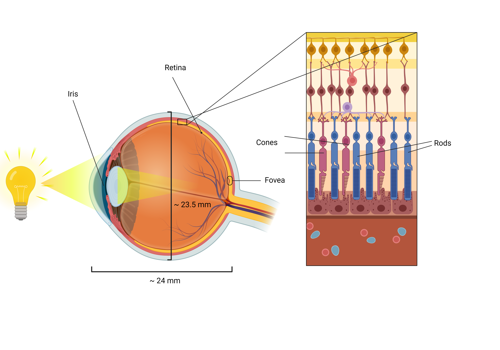
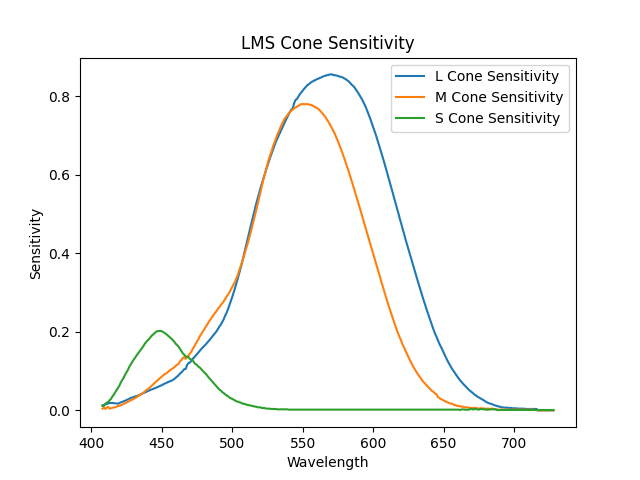

## Color Science
[Biomimetic Eye Modeling & Deep Neuromuscular Oculomotor Control](https://www.andrew.cmu.edu/user/aslakshm/pdfs/siggraph19_eye.pdf)
## Color Perception

We can establish an understanding on color perception through studying its physical and perceptual meaning, so we can understand motivations behind display, computer graphics and camera technologies.

### What is Color?

Color can be explained in a physical and perceptual capacity. In the physical sense, color is a quantity typically described using a wavelength of light. Humans can only percieve color within a certain range of the electromagnetic spectrum, from around 400 nanometers to 700 nanometers. For greater details on the electromagnetic spectrum and concept of wavelength, we recommend revisiting [Light, Computation, and Computational Light](computational_light.md) section of our course. Color is also a perceptual phenomenon arising from the human visual system's interaction with light. Color is essentially a "side effect" created by our brain when specific wavelengths of light are emitted, reflected, or transmitted by objects.

### Biological Foundations of Perceiving Color
The perception of color originates from the absorption of light by photoreceptors in the eye, converting the light into electrical signals to be interpreted by the brain[^1].

<figure markdown>
  { width="600" }
  <figcaption>Anatomy of an Eye (Designed with BioRender)</figcaption>
</figure> [^2]

<figure markdown>
  { width="600" }
  <figcaption>Live Capture of Photoreceptor Cells (CC PDM 1.0 by NIH)</figcaption>
</figure>

<figure markdown>
  { width="600" }
  <figcaption>Retinal Photoreceptor Distribution (Image adapted from GOLDSTEIN E. B.: Sensation and Perception, 8th ed. Wadsworth-Thomson Learning, Pacific Grove, 2010.)</figcaption>
</figure>
The photoreceptors, where color perception originates, are called [rods and cones](https://www.ncbi.nlm.nih.gov/pmc/articles/PMC4763127/)[^3]. Rods, which are relatively more common in the periphery, help people see in low-light (scotopic) conditions, but can only interpret in a greyscale manner. Cones, which are more dense in the fovea, are pivotal in color perception in brighter (photopic) environments. The cones are categorized into three types based on their sensitivity to specific wavelengths of light, corresponding to long (L), medium (M), and short (S) wavelength cones. These [three types of cones](https://opg.optica.org/josaa/fulltext.cfm?uri=josaa-31-4-A195&id=279354)[^4] allow us to better understand the [trichromatic theory](https://www.jstor.org/stable/82365)[^5], suggesting that human color perception stems from combining stimulations of the LMS cones. Scientists have tried to graphically represent how sensitive each type of cone is to different wavelengths of light, which is known as the spectral sensitivity function[^6].

??? question end "Would you like to learn more about LMS?"
       Check out this paper, we find it insightful: [ B. P. Schmidt, M. Neitz, and J. Neitz, "Neurobiological hypothesis of color appearance and hue perception," J. Opt. Soc. Am. A 31(4), A195–207 (2014)](https://doi.org/10.1364/josaa.31.00a195)! 

<figure markdown>
  { width="600" }
  <figcaption>Spectral Sensitivities of LMS cones</figcaption>
</figure>

The story of color perception only deepens with the concept of [color opponency](http://dx.doi.org/10.1364/JOSAA.34.001099)[^7]. This theory reveals that our perception of color is not just a matter of additive combinations of primary colors but also involves a dynamic interplay of opposing colors: red versus green, blue versus yellow. This phenomenon is rooted in the neural pathways of the eye and brain, where certain cells are excited or inhibited by specific wavelengths, enhancing our ability to distinguish between subtle shades and contrasts.

??? question end "How can I find the LMS response of an image using odak?"
       Check out this [engineering note](../notes/color_perception.md)! 

### Display Realism (What does it mean to be realistic)

When considering the realism of displays, it is important to define what realism entails in the context of color perception. If we were to have a display, disregarding all cost and engineering challenges, just solely built to be "lifelike", what would we need to achieve? 

To answer this question, we would need to be able to apply the complex principles of human color perception and display technologies.

#### Accurate Reproduction of Colors (or at least perceptible): 
The most important characteristic of a realistic display is to accurately reproduce color. Current display technologies combine three color primaries (Red, Green, Blue) in different intensities attempting to recreate large ranges of color called a color space. It is possible to choose different primary colors, or even the number of primaries to represent one's color space, but its efficacy can be expressed by how vast the resulting color space is. The human color gamut is a collection of all visible human lights, and is currently impossible to represent with only three primaries. Because the gamut is continuous and infinite, you would need an infinite amount of primaries to represent all colors.

Fortunately, one promising solution is the use of *metamers*— applying different combinations of wavelengths that produce the same color perception in the human eye. This means two separate colors can elicit the same LMS cone response as each other. This allows displays to recreate a vast range of colors on a limited set of primaries.

[Code](https://gulpinhenry.github.io/PrismaFoveate/optimize_primaries.html) on how to optimize display primaries with a color space

#### Accounting for Photopic vs Scotopic vision
Human perception is extremely context dependent, where we need to adapt to various lighting conditions like low-light (scotopic) and lit (photopic) scenes. Displays must be able to figure out how to preserve the rod and cone functionality under all these different environments.

#### Chromaticity + Brightness
<!-- TODO: add some more stuff here -->

### Conclusion
As we dive deeper into light and color perception, it becomes evident that the task of replicating the natural spectrum of colors in technology is still an evolving journey. This exploration into the nature of color sets the stage for a deeper examination of how our biological systems perceive color and how technology strives to emulate that perception.

[^1]: [Freeman, J. and Simoncelli, E.P. 2011. Metamers of the ventral stream. Nature Neuroscience 14, 1195–1201. http://dx.doi.org/10.1038/nn.2889.](https://doi.org/10.1038/nn.2889)
[^2]: [Cleveland Clinic. 2024. Photoreceptors (Rods and Cones). Cleveland Clinic. Accessed September 27, 2024. https://my.clevelandclinic.org/-/scassets/images/org/health/articles/photoreceptors-rods-and-cones.](https://my.clevelandclinic.org/-/scassets/images/org/health/articles/photoreceptors-rods-and-cones)
[^3]: [Lamb, T.D. 2015. Why rods and cones? Eye 30, 179–185. http://dx.doi.org/10.1038/eye.2015.236.](https://doi.org/10.1038/eye.2015.236)
[^4]: [Schmidt, B.P., Neitz, M., and Neitz, J. 2014. Neurobiological hypothesis of color appearance and hue perception. Journal of the Optical Society of America A 31, A195. http://dx.doi.org/10.1364/JOSAA.31.00A195.](https://doi.org/10.1364/JOSAA.31.00A195)
[^5]: [Some experiments on the trichromatic theory of vision. 1942. Proceedings of the Royal Society of London. Series B - Biological Sciences 131, 27–50. http://dx.doi.org/10.1098/rspb.1942.0016.](https://doi.org/10.1098/rspb.1942.0016)
[^6]: [Stockman, A. and Sharpe, L.T. 2000. The spectral sensitivities of the middle- and long-wavelength-sensitive cones derived from measurements in observers of known genotype. Vision Research 40, 1711–1737. http://dx.doi.org/10.1016/S0042-6989(00)00021-3.](https://doi.org/10.1016/S0042-6989(00)00021-3)
[^7]: [Shevell, S.K. and Martin, P.R. 2017. Color opponency: tutorial. Journal of the Optical Society of America A 34, 1099. http://dx.doi.org/10.1364/JOSAA.34.001099.](http://dx.doi.org/10.1364/JOSAA.34.001099)

