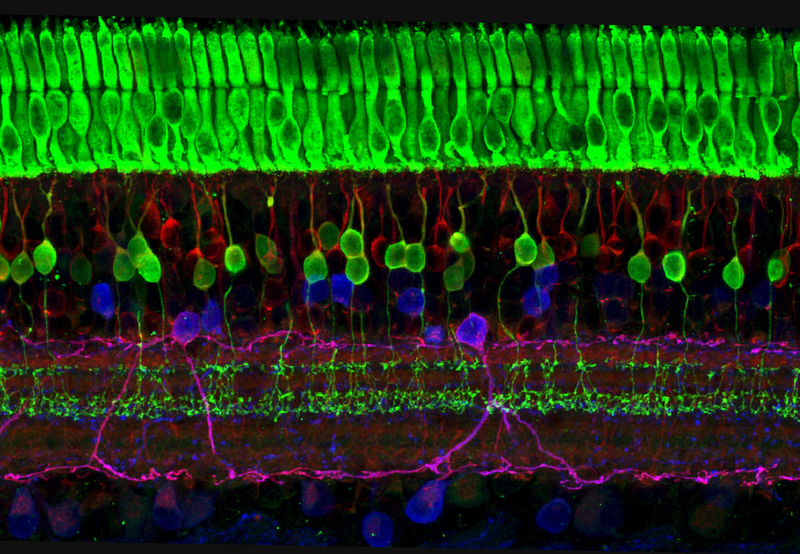
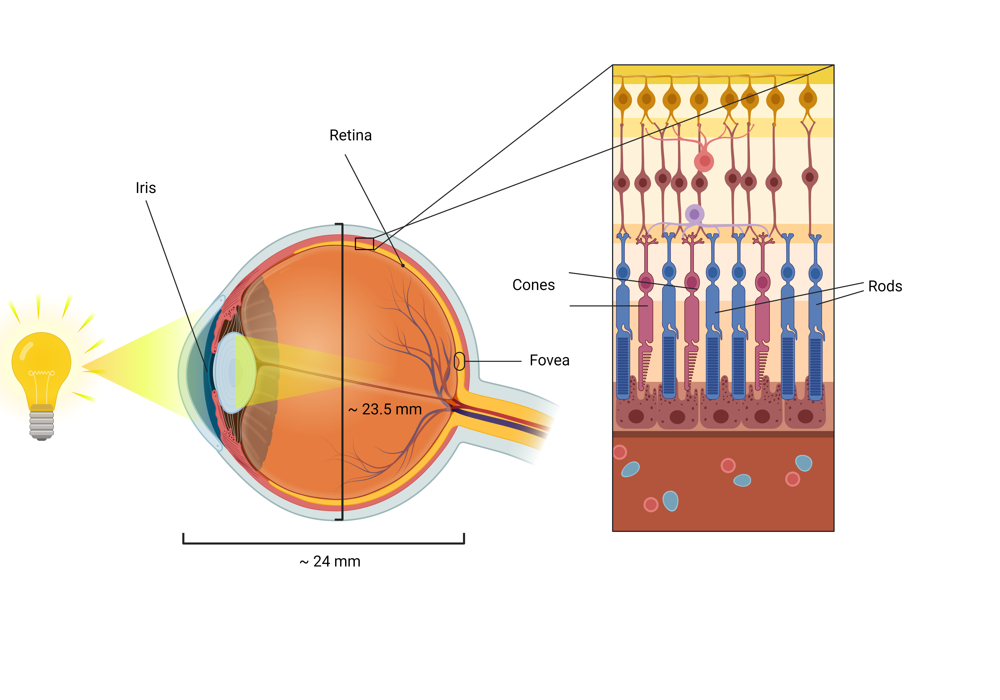
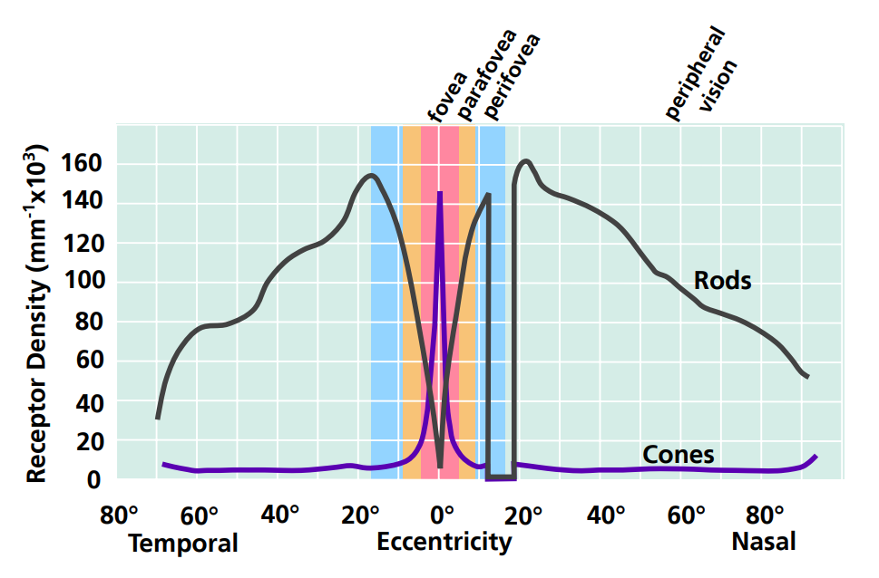
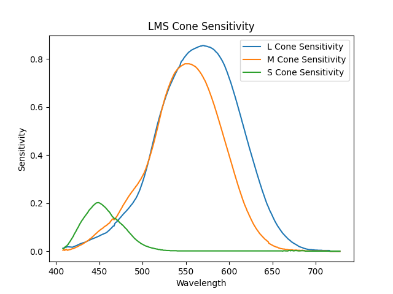

## Color Perception :material-alert-decagram:{ .mdx-pulse title="Too important!" }
:octicons-info-24: Informative ·
:octicons-beaker-24: Practical

We can establish an understanding on color perception through studying its physical and perceptual meaning.
This way, we can gather more information on its relation to technologies and devices including displays, cameras, sensors, communication devices, computers and computer graphics.

Color, a perceptual phenomenon, can be explained in a physical and visual perception capacity.
In the physical sense, color is a quantity representing the response to wavelength of light.
The human visual system can perceive colors within a certain range of the electromagnetic spectrum, from around 400 nanometers to 700 nanometers.
For greater details on the electromagnetic spectrum and concept of wavelength, we recommend revisiting [Light, Computation, and Computational Light](computational_light.md) section of our course.
For the human visual system, color is a perceptual phenomenon created by our brain when specific wavelengths of light are emitted, reflected, or transmitted by objects.
The perception of color originates from the absorption of light by photoreceptors in the eye.
These photoreceptor cells convert the light into electrical signals to be interpreted by the brain[@freeman2011metamers].
Here, you can see a close-up photograph of these photoreceptor cells found in the eye.

<figure markdown>
  { width="600" }
  <figcaption>Micrograph of retinal photoreceptor cells, with rods and cones highlighted in green (top row). Image courtesy of NIH, licensed under CC PDM 1.0. <a href="https://www.nih.gov/" target="_blank">View source</a>.</figcaption>
</figure>

The photoreceptors, where color perception originates, are called [rods and cones](https://www.ncbi.nlm.nih.gov/pmc/articles/PMC4763127/)[@lamb2015why]. 
Here, we provide a sketch showing where these rods and cones are located inside the eye.
By closely observing this sketch, you can also understand the basic average geometry of a human eye and its parts helping to redirect light from an actual scene towards retinal cells.

<figure markdown>
  { width="600" }
  <figcaption>Anatomy of an Eye (Designed with <a href="https://app.biorender.com/citation/6702e9cd8e56383950107e6d" target="_blank">BioRender.com</a>).</figcaption>
</figure>

Rods, which are relatively more common in the periphery, help people see in low-light (scotopic) conditions.
The current understanding is that the rods can only interpret in a greyscale manner.
Cones, which are more dense in the fovea, are pivotal in color perception in brighter (photopic) environments. 
We highlight the distribution of these photoreceptor cells, rods and cones with changing eccentricities in the eye.
Here, the word `eccentricities` refer to angles with respect to our gaze direction.
For instance, if a person is not directly gazing at a location or an object in a given scene, that location or the object would have some angle to the gaze of that person.
Thus, there would be at some angles, some eccentricity between the gaze of that person and that location or object in that scene.

<figure markdown>
  { width="600" }
  <figcaption>Retinal Photoreceptor Distribution, adapted from the work by Goldstein et al [3].</figcaption>
</figure>

In the above sketch, we introduced various parts on the retina, including fovea, parafovea, perifovea and peripheral vision.
Note that these regions are defined by the angles, in other words eccentricities.
Please also note that there is a region on our retina where there are no rods and cones are available.
This region could be found in every human eye and known as the blind spot on the retina.
Visual acuity and contrast sensitivity decreases progressively across these identified regions, with the most detail in the fovea, diminishing toward the periphery.

<figure markdown>
  { width="600" }
  <figcaption>Spectral Sensitivities of LMS cones</figcaption>
</figure>

The cones are categorized into three types based on their sensitivity to specific wavelengths of light, corresponding to long (L), medium (M), and short (S) wavelength cones. These [three types of cones](https://opg.optica.org/josaa/fulltext.cfm?uri=josaa-31-4-A195&id=279354)[@schmidt2014neurobiological] allow us to better understand the [trichromatic theory](https://www.jstor.org/stable/82365)[@rspb1942trichromatic], suggesting that human color perception stems from combining stimulations of the LMS cones. Scientists have tried to graphically represent how sensitive each type of cone is to different wavelengths of light, which is known as the spectral sensitivity function[@stockman2000spectral]. In practical applications such as display technologies and computational imaging, the LMS cone response can be replicated with the following formula:


$$
LMS = \sum_{i=1}^{3} \text{RGB}_i \cdot \text{Spectrum}_i \cdot \text{Sensitivity}_i 
$$

Where:

- \(RGB_i\): The i-th color channel (Red, Green, or Blue) of the image.  
- \(Spectrum_i\): The spectral distribution of the corresponding primary 
- \(Sensitivity_i\): The sensitivity of the L, M, and S cones for each wavelength.

This formula gives us more insight on how we percieve colors from different digital and physical inputs.

??? question end "Looking for more reading to expand your understanding on human visual system?"
       We recommend these papers, which we find it insightful:
       <br />- [ B. P. Schmidt, M. Neitz, and J. Neitz, "Neurobiological hypothesis of color appearance and hue perception," J. Opt. Soc. Am. A 31(4), A195–207 (2014)](https://doi.org/10.1364/josaa.31.00a195)
       <br />- [Biomimetic Eye Modeling & Deep Neuromuscular Oculomotor Control](https://www.andrew.cmu.edu/user/aslakshm/pdfs/siggraph19_eye.pdf)


The story of color perception only deepens with the concept of [color opponency](http://dx.doi.org/10.1364/JOSAA.34.001099)[@shevell2017color].
This theory reveals that our perception of color is not just a matter of additive combinations of primary colors but also involves a dynamic interplay of opposing colors: red versus green, blue versus yellow. 
This phenomenon is rooted in the neural pathways of the eye and brain, where certain cells are excited or inhibited by specific wavelengths, enhancing our ability to distinguish between subtle shades and contrasts.
Below is a mathematical formulation for the color opponency model proposed by [Schmidt et al.](https://opg.optica.org/josaa/fulltext.cfm?uri=josaa-31-4-A195&id=279354)[@schmidt2014neurobiological]

\begin{bmatrix}
I_{(M+S)-L} \\
I_{(L+S)-M} \\
I_{(L+M+S)}
\end{bmatrix}
=
\begin{bmatrix}
(I_M + I_S) - I_L \\
(I_L + I_S) - I_M \\
(I_L, I_M, I_S)
\end{bmatrix}

In this equation, \(I_L\), \(I_M\), and \(I_S\) represent the intensities received by the long, medium, and short cone cells, respectively. Opponent signals are represented by the differences between combinations of cone responses.


We could exercise on our understanding of trichromat sensation with LMS cones and the concept of color opponency by vising the functions available in our toolkit, `odak`.
The utility function we will review is [`odak.learn.perception.display_color_hvs.primarier_to_lms()`](https://github.com/kaanaksit/odak/blob/321760f2f2f3e2639301ecb32535cc801f53dd64/odak/learn/perception/color_conversion.py#L292) from [`odak.learn.perception`](../odak/learn_perception.md).
Let us use this test to demonstrate how we can obtain LMS sensation from the color primaries of an image.

=== ":octicons-file-code-16: `test_learn_perception_display_color_hvs.py`"
  ```python 
  --8<-- "test/test_learn_perception_display_color_hvs.py"
  ```

  1. Adding `odak` to our imports.
  2. Loading an existing RGB image.
  3. Defining the spectrum of our primaries of our imaginary display. These values are defined for each primary from 400 nm to 701 nm (301 elements).
  4. Obtain LMS cone sensations for our primaries of our imaginary display.
  5. Calculating the LMS sensation of our input RGB image at the second stage of color perception using our imaginary display.
  6. Calculating the LMS sensation of our input RGB image at the third stage of color perception using our imaginary display.
  7. We are intentionally adding some noise to the input RGB image here.
  8. We calculate the perceptual loss/difference between the two input image (original RGB vs noisy RGB).
  <br />
  This a visualization of a randomly generated image and its' LMS cone sensation.

Our code above saves three different images.
The very first saved image is the ground truth RGB image as depicted below.

<figure markdown>
  { width="300" }
  <figcaption>Original ground truth image.</figcaption>
</figure>

We process this ground truth image by accounting human visual system's cones and display backlight spectrum.
This way, we can calculate how our ground truth image is sensed by LMS cones.
The LMS sensation, in other words, ground truth image in LMS color space is provided below.
Note that each color here represent a different cone, for instance, green color channel of below image represents medium cone and blue channel represents short cones.
Keep in mind that LMS sensation is also known as trichromat sensation in the literature.

<figure markdown>
  { width="300" }
  <figcaption>Image in LMS cones trichromat space.</figcaption>
</figure>

Earlier, we discussed about the color oppenency theory.
We follow this theory, and with our code, we utilize trichromat values to derive an image representation below.

<figure markdown>
  { width="300" }
  <figcaption>Image representation of color opponency.</figcaption>
</figure>

??? example end "Lab work: Observing the effect of display spectrum"
    We introduce our unit test, `test_learn_perception_display_color_hvs.py`, to provide an example on how to convert an RGB image to trichromat values as sensed by the retinal cone cells.
    Note that during this exercise, we define a variable named `multi_spectrum` to represent the wavelengths of our each color primary.
    These wavelength values are stored in a vector for each primary and provided the intensity of a corresponding wavelength from 400 nm to 701 nm.
    The trichromat values that we have derived from our original ground truth RGB image is highly correlated with these spectrum values.
    To observe this correlation, we encourage you to find spectrums of actual display types (e.g., OLEDs, LEDs, LCDs) and map the `multi_spectrum` to their spectrum to observe the difference in color perception in various display technologies.
    In addition, we believe that this will also give you a practical sandbox to examine the correlation between wavelengths and trichromat values.
<!--
### Display Realism (What does it mean to be realistic)

When considering the realism of displays, it is important to define what realism entails in the context of color perception. If we were to have a display, disregarding all cost and engineering challenges, just solely built to be "lifelike", what would we need to achieve? 

To answer this question, we would need to be able to apply the complex principles of human color perception and display technologies.

#### Accurate Reproduction of Colors (or at least perceptible): 
The most important characteristic of a realistic display is to accurately reproduce color. Current display technologies combine three color primaries (Red, Green, Blue) in different intensities attempting to recreate large ranges of color called a color space. It is possible to choose different primary colors, or even the number of primaries to represent one's color space, but its efficacy can be expressed by how vast the resulting color space is. The human color gamut is a collection of all visible human lights, and is currently impossible to represent with only three primaries. Because the gamut is continuous and infinite, you would need an infinite amount of primaries to represent all colors.

Fortunately, one promising solution is the use of *metamers*— applying different combinations of wavelengths that produce the same color perception in the human eye. This means two separate colors can elicit the same LMS cone response as each other. This allows displays to recreate a vast range of colors on a limited set of primaries.

[Code](https://gulpinhenry.github.io/PrismaFoveate/optimize_primaries.html) on how to optimize display primaries with a color space


#### Accounting for Photopic vs Scotopic vision
Human perception is extremely context dependent, where we need to adapt to various lighting conditions like low-light (scotopic) and lit (photopic) scenes. Displays must be able to figure out how to preserve the rod and cone functionality under all these different environments.


#### Chromaticity + Brightness
TODO: add some more stuff here

-->


### Closing remarks
As we dive deeper into light and color perception, it becomes evident that the task of replicating the natural spectrum of colors in technology is still an evolving journey.
This exploration into the nature of color sets the stage for a deeper examination of how our biological systems perceive color and how technology strives to emulate that perception.


??? tip end "Consider revisiting this chapter"
    Remember that you can always revisit this chapter as you progress with the course and as you need it.
    This chapter is vital for establishing a means to complete your assignments and could help formulate a suitable base to collaborate and work with [my research group](https://complightlab.com) in the future or other experts in the field.

!!! warning end "Reminder"
    We host a Slack group with more than 300 members.
    This Slack group focuses on the topics of rendering, perception, displays and cameras.
    The group is open to public and you can become a member by following [this link](https://complightlab.com/outreach/).
    Readers can get in-touch with the wider community using this public group.


### Loss Functions for Color Vision Deficiency Simulation

:octicons-info-24: Informative ·
:octicons-beaker-24: Practical

When designing personalized image generation systems for individuals with Color Vision Deficiency (CVD), we need quantitative metrics to evaluate how well our generated images preserve visual information under CVD conditions. The `odak.learn.perception` module provides specialized loss functions based on the methodology from the paper "Personalized Image Generation for Color Vision Deficiency Population" (ICCV 2023).

These loss functions measure two critical aspects:

1. **Local Contrast Loss ($L_{LC}$)**: Measures the decay of local contrast between an original image and its CVD simulation. This ensures that edges and boundaries remain distinguishable under CVD conditions.

2. **Color Information Loss ($L_{CI}$)**: Measures the L1 distance between primary colors after applying Gaussian blur to both images. This focuses on preserving the main color information while avoiding excessive detail.

The combined CVD loss is formulated as:

$$
L_{CVD} = \alpha \cdot L_{LC} + \beta \cdot L_{CI}
$$

where $\alpha = 15.0$ and $\beta = 1.0$ are the default weighting parameters determined by the authors.


=== ":octicons-file-code-16: `test_learn_perception_cvd_loss.py`"

    ```python 
    --8<-- "test/test_learn_perception_cvd_loss.py"
    ```

    1. Required imports for CVD loss computation.
    2. Generate synthetic RGB images [B, C, H, W] for testing.
    3. Create a CVD-simulated version of the image (scaled by 0.8).
    4. Compute the combined CVD loss with default weights (α=15.0, β=1.0).
    5. Access individual component losses: local contrast and color information.
    6. Verify gradient flow through the loss computation for optimization.


In practice, you would use these losses during training to optimize image generation networks. The local contrast loss encourages preservation of structural information, while the color information loss ensures that primary colors remain distinguishable under CVD simulation.


#### Local Contrast Loss

The local contrast loss evaluates how well local contrast patterns are preserved between the original image and its CVD simulation:

$$
L_{LC}(I, \delta_s) = 1 - \frac{1}{N} \sum_{j=1}^{N} \frac{\min(C_{ori}, C_{sim})}{\max(C_{ori}, C_{sim})}
$$

where $C_{ori}$ and $C_{sim}$ are the contrasts of corresponding patches in the original and simulated images, respectively. A value close to 0 indicates good contrast preservation.

=== ":octicons-file-code-16: `local_contrast_loss` Usage"

    ```python
    from odak.learn.perception import local_contrast_loss
    import torch

    # Original and CVD-simulated images
    original = torch.rand(1, 3, 128, 128)
    simulated = torch.rand_like(original) * 0.9  # Simulated CVD version

    # Compute local contrast loss
    loss = local_contrast_loss(original, simulated)
    print(f"Local contrast loss: {loss.item():.4f}")
    ```


#### Color Information Loss

The color information loss focuses on primary colors by applying Gaussian blur before comparison:

$$
L_{CI}(I, \delta_s) = \|\Phi(I) - \Phi(\text{Sim}(I, \delta_s))\|_1
$$

where $\Phi(\cdot)$ denotes a Gaussian blur operator that extracts the primary color information while suppressing excessive detail.


=== ":octicons-file-code-16: `color_information_loss` Usage"

    ```python
    from odak.learn.perception import color_information_loss
    import torch

    # Original and CVD-simulated images
    original = torch.rand(2, 3, 256, 256)
    simulated = torch.rand_like(original) * 0.85

    # Compute color information loss with custom blur parameters
    loss = color_information_loss(original, simulated, kernel_size=7, sigma=1.5)
    print(f"Color information loss: {loss.item():.4f}")
    ```


#### Combined CVD Loss

For practical applications, the combined loss allows balancing between contrast preservation and color information retention:

=== ":octicons-file-code-16: `cvd_loss` Complete Workflow"

    ```python
    from odak.learn.perception import cvd_loss
    import torch

    # Training data
    original_images = torch.rand(4, 3, 128, 128)
    cvd_simulated = original_images * 0.8  # Simplified CVD simulation

    # Compute combined loss
    total_loss, local_contrast, color_info = cvd_loss(
        original_images, 
        cvd_simulated,
        alpha=15.0,  # Weight for local contrast
        beta=1.0     # Weight for color information
    )

    print(f"Total CVD loss: {total_loss.item():.4f}")
    print(f"  Local contrast component: {local_contrast.item():.4f}")
    print(f"  Color information component: {color_info.item():.4f}")
    ```


??? question end "How are the weighting parameters (α, β) determined?"
    The default values α=15.0 and β=1.0 were empirically determined by the authors to balance the importance of contrast preservation against color information retention. In practice, you may need to adjust these weights based on:

    - The severity of CVD (protanopia, deuteranopia, tritanopia)
    - The specific application (medical imaging, display design, accessibility testing)
    - Subjective user studies with CVD individuals


??? abstract end "[Challenge: Implement CVD-aware image generation](https://github.com/kaanaksit/odak/discussions/76)"
    Using the loss functions provided, implement a complete image generation pipeline optimized for CVD accessibility:

    1. Create a simple generator network that transforms input images
    2. Use the combined CVD loss as your objective function
    3. Train your generator to produce images that maintain information under CVD simulation
    4. Evaluate your results using standard metrics and potentially user studies

    To add these to `odak`, you can rely on the `pull request` feature on GitHub. You can also create a new `engineering note` for CVD-aware generation in `docs/notes/cvd_image_generation.md`.


??? tip end "Lab Exercise: Optimizing Display Colors for CVD"
    As a practical exercise, try the following:

    1. Generate a set of test images with various color palettes
    2. Apply CVD simulation to each image
    3. Compute the CVD loss for different color combinations
    4. Identify which color combinations minimize the loss (are most CVD-friendly)
    5. Experiment with adjusting the loss weights (α, β) to prioritize different aspects

    This exercise will give you hands-on experience with perceptual optimization and help you understand the trade-offs in designing CVD-accessible content.


<!--
### Future improvements
- Implement additional CVD types (protanopia, deuteranopia, tritanopia)
- Add support for adaptive loss weighting based on image content
- Incorporate user feedback loops for personalized optimization
-->
