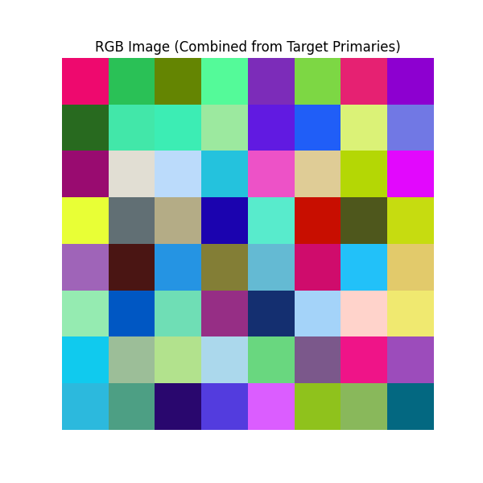
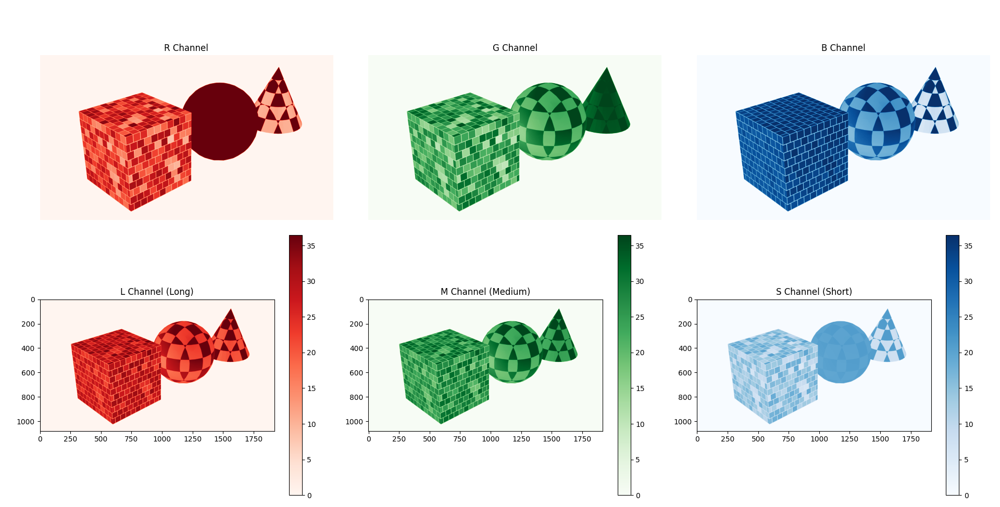

# Color Perception

This section is focused on human color perception and its relation to display and graphics technologies.

## What is Color

Color can be explained in a physical and perceptual capacity. In the physical sense, color is a physical quantity, measured by a wavelength of light. However, humans can only percieve color within a certain range of the electromagnetic spectrum, from around 300 to 700 nanometers. 


As a result, color can also be interpreted as a perceptual phenomenon arising from the human visual system's interaction with light. Color is essentially a "side effect" created by our brain when specific wavelengths of light are emitted, reflected, or transmitted by objects.

??? tip end "Did you know this source?"
    For more in depth discussion about the physical interpretation of light, please consult [this computational light note](../course/computational_light.md) for more.

The common understanding among the physics and computer science community is that different wavelength frequencies do not constructively or destructively interfere, so it is interesting to see how our brain can process multiple frequencies of light simultaneously.


## Biological Foundations of Perceiving Color
The perception of color originates from the absorption of light by photoreceptors in the eye, converting the light into electrical signals to be interpreted by the brain. This note will only discuss the role of our eyes; for more information about how brain percieves light, please refer to [this paper](https://pubmed.ncbi.nlm.nih.gov/21841776/)

The photoreceptors where color perception originates are called [rods and cones](https://www.ncbi.nlm.nih.gov/pmc/articles/PMC4763127/). Rods, which are relatively more common in the periphery, help people see in low-light conditions, but can only interpret in a greyscale manner. Cones, which are more dense in the fovea, are pivotal in color perception in relatively normal environments. The cones are categorized into three types based on their sensitivity to specific wavelengths of light, corresponding to long (L), medium (M), and short (S) wavelengths. These [three types of cones](https://opg.optica.org/josaa/fulltext.cfm?uri=josaa-31-4-A195&id=279354) allow us to better understand the [trichromatic theory](https://www.jstor.org/stable/82365), which suggests that human color perception stems from combining stimulations of the LMS cones, which correspond to red, green, and blue light, respectively. For example, red is perceived when L cones are significantly stimulated more than the other types, and blue is perceived when S cone activation is more prominent. Scientists have tried to graphically represent how sensitive each type of cone is to different wavelengths of light, which is known as the spectral sensitivity function.

??? question end "Would you like to learn more about LMS?"
   Check out [this paper: B. P. Schmidt, M. Neitz, and J. Neitz, "Neurobiological hypothesis of color appearance and hue perception," J. Opt. Soc. Am. A 31(4), A195–207 (2014)](https://europepmc.org/article/pmc/4167798)! 


|  |
|:--:| 
| *Spectral Sensitivities of LMS cones*|

However, the story of color perception deepens with the concept of [color opponency](https://pubmed.ncbi.nlm.nih.gov/1303712/). This theory reveals that our perception of color is not just a matter of additive combinations of primary colors but also involves a dynamic interplay of opposing colors: red versus green, blue versus yellow. This phenomenon is rooted in the neural pathways of the eye and brain, where certain cells are excited or inhibited by specific wavelengths, enhancing our ability to distinguish between subtle shades and contrasts.
<!-- TODO: convert image to LMS graph + explaination -->


The utility function we will review is `odak.learn.perception.color_conversion.primaries_to_lms()`:


=== ":octicons-file-code-16: `odak.learn.perception.color_conversion.primaries_to_lms`"

    ::: odak.learn.perception.primaries_to_lms


Let us use this utility function to expand our previous code snippet and show how we can obtain LMS sensation from the color primaries of an image using that:

```python
import odak # (1)
import torch
import sys
from odak.learn.perception.color_conversion import display_color_hvs
from odak.learn.tools import load_image, save_image, resize 

num_primaries = 3
image_primaries = torch.rand(1,
                             num_primaries,
                             8,
                             8
                             ) # (2)

multi_spectrum = torch.rand(num_primaries,
                            301
                           ) # (3)
device_ = torch.device('cpu')
display_color = display_color_hvs(read_spectrum ='tensor',
                                  primaries_spectrum=multi_spectrum,
                                  device = device_)
lms_color = display_color.primaries_to_lms(image_primaries)  # (4)
```

1. Adding `odak` to our imports.
2. Generating arbitrary target primaries (the sample image).
3. Generate arbitrary primaries spectrum
4. Obtain LMS cone sensation using  `odak.learn.perception.color_conversion.primaries_to_lms`

|  |
|:--:| 
| *Sample Generated Image Primaries*|

|  |
|:--:| 
| *LMS Sensation of Image Primaries*|
>>>>>>> 56ec924 (add images and code example for LMS sensation generation)

## Display Realism (What does it mean to be realistic)

When considering the realism of displays, it is important to define what realism entails in the context of color perception. If we were to have a display, disregarding all cost and engineering challenges, just solely built to be "lifelike", what would we need to achieve? To answer this question, we would need to be able to apply the complex principles of human color perception and display technologies. 

1. Accurate Reproduction of Colors (or at least perceptible)
The most important characteristic of a realistic display is to accurately reproduce color. Current display technologies combine three color primaries (Red, Green, Blue) in different intensities attempting to recreate large ranges of color called a color space. It is possible to choose different primary colors, or even the number of primaries to represent one's color space, but its efficacy can be expressed by how vast the resulting color space is. The human color gamut is a collection of all visible human lights, and is currently impossible to represent with only three primaries. Because the gamut is continuous and infinite, you would need an infinite amount of primaries to represent all colors.

Fortunately, one promising solution is the use of **metamers**— applying different combinations of wavelengths that produce the same color perception in the human eye. This means two separate colors can ellicit the same LMS cone response as each other. This allows displays to recreate a vast range of colors on a limited set of primaries. 
!! TODO: talk about generating the color space with primaries 

2. Accounting for Photopic vs Scotopic vision
Human perception is extremely context dependent, where we need to adapt to various lighting conditions like low-light (scotopic) and lit (photopic) scenes. Displays must be able to figure out how to preserve the rod and cone functionality under all these different environments.
>>>>>>> b72dd53 (add notes to docs)

<<<<<<< HEAD
3. Chromaticity + Brightness
=======

### Chromaticity + Brightness
<!-- TODO: add some more stuff here -->


## Conclusion
As we dive deeper into light and color perception, it becomes evident that the task of replicating the natural spectrum of colors in technology is still an evolving journey. This exploration into the nature of color sets the stage for a deeper examination of how our biological systems perceive color and how technology strives to emulate that perception.
